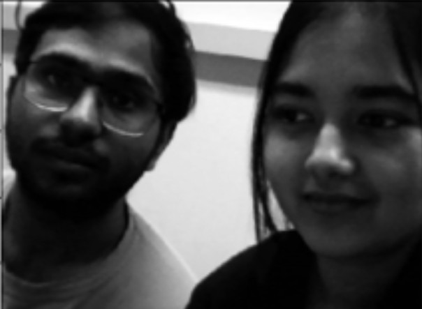
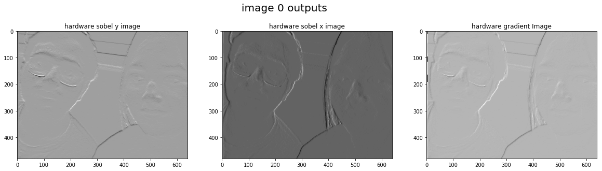
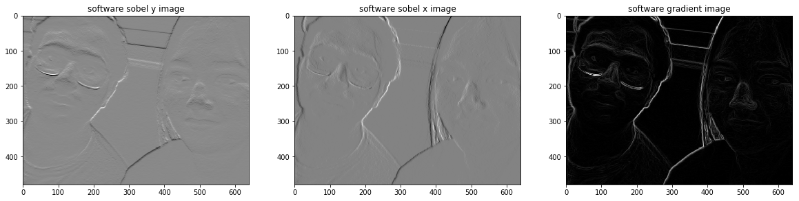

# 🔲 Real-Time Sobel Edge Detection on FPGA (Pynq-Z2)

This project implements real-time image edge detection using Sobel filters accelerated in hardware on a Pynq-Z2 FPGA board. Webcam input is processed through custom VHDL-based IP cores and displayed on an HDMI monitor. The design achieves over **200× speedup** compared to software execution.

> ⚙️ **Led hardware implementation, VHDL IP design, and system integration using Vivado.**

---

## 👤 Author

**Shivaum Shashikant Heranjal**  
Graduate Student – Electrical & Computer Engineering  
Purdue University  

> 🛠️ *Developed in collaboration with a teammate as part of an academic project. Hardware design and integration led by Shivaum Heranjal.*

---

## 🧠 Key Contributions

- **Designed AXI Stream-compatible IPs** for Sobel X and Sobel Y filters using VHDL.
- **Integrated IPs into Vivado block design** with DMA, AXI SmartConnect, and PS-PL interfaces.
- **Developed Python Jupyter Notebook** for capturing webcam input, managing buffers, and computing image gradients using OpenCV and NumPy.
- Achieved **~200× performance gain** by offloading Sobel filtering to hardware.
- **Delivered end-to-end functional demo** including HDMI output and hardware-software benchmarking.
- **Collaborated** with a teammate on final report and presentation formatting.

---

## 📷 Demo Outputs

| Input Image | HW output | SW output |
|-------------|--------------|-----------|
|  |  |  | 

---

## 🛠️ Tech Stack

- **Hardware Design**: VHDL, Vivado 2018.3, AXI4-Lite, AXI-Stream, DMA, SmartConnect
- **Platform**: Pynq-Z2 (Zynq-7020, Dual-Core ARM Cortex-A9)
- **Software**: Python, OpenCV, NumPy, Jupyter Notebook
- **Output Interface**: HDMI display (1280×720)
- **Image Input**: USB Webcam (640×480)

---

## 📂 Repository Structure

```
sobel-edge-detection-fpga/
├── vivado_project/
│   ├── final_project.xpr.zip              ← Complete Vivado project archive
│   ├── FILTERH_sobel_x.vhd                ← Horizontal 1D filter for Sobel X
│   ├── FILTERV_sobel_x.vhd                ← Vertical 1D filter for Sobel X
│   ├── FILTERH_sobel_y.vhd                ← Horizontal 1D filter for Sobel Y
│   ├── FILTERV_sobel_y.vhd                ← Vertical 1D filter for Sobel Y
│   ├── mynewfilter_v1_0 (sobel x).vhd     ← Sobel X wrapper IP core
│   └── sobel_y_2nd_trail_v1_0.vhd         ← Final Sobel Y wrapper IP with fix
├── jupyter_notebooks/
│   └── final_notebook.ipynb               ← Python control & gradient calculation
├── images/
│   ├── input/                             
│   ├── output_hw/
│   └── output_sw/
├── reports/
│   ├── final_report.pdf
│   └── presentation.pptx
└── README.md
```

**For full Vivado build files, see `final_project.xpr.zip` in `vivado_project/`.**

---

## ⚡ Performance Metrics

| **Metric**                                | **Software** | **Hardware**                  |
|-------------------------------------------|--------------|-------------------------------|
| **Sobel X/Y filter execution time**       | ~240 ms      | ~1.2 ms                       |
| **Total system time (including gradient)**| ~1.4 s       | ~1.266 s                      |
| **FPGA Utilization**                      | N/A          | < 20% LUTs, < 10% FFs         |
| **Power Consumption**                     | N/A          | 1.7 W                         |
| **Worst Slack**                           | N/A          | -7.84 ns                      |

> **Note:** Gradient is computed in software. Offloading this to hardware is a key future improvement.


---

## 🔭 Future Enhancements

- Implement hardware gradient computation to eliminate software bottleneck.
- Merge HDMI display overlay into custom bitstream for cleaner deployment.
- Generalize architecture to support arbitrary separable 3×3 kernels.
- Explore real-time video processing using HDMI-In and frame buffering.

---

## 📄 License

This repository is licensed under the MIT License.

---
